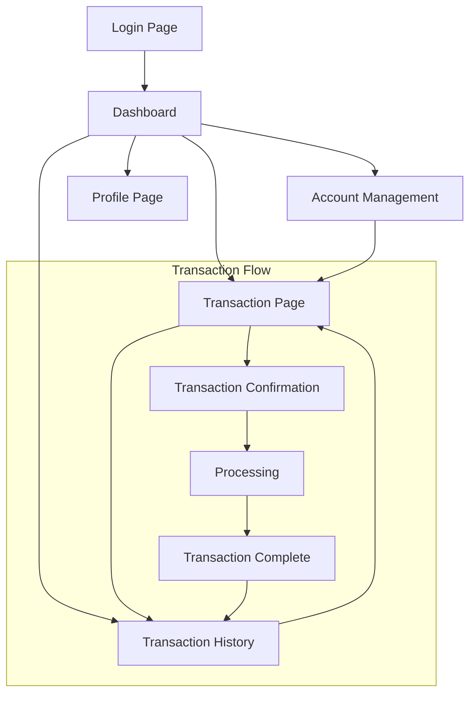

## 1. Product Overview
A modern banking system frontend that provides secure and intuitive account management, financial transactions, and transaction history viewing. The application enables users to manage their bank accounts, perform deposits and withdrawals, transfer funds between accounts, and track their financial activities through a comprehensive transaction history.

The system serves individual banking customers who need convenient access to their financial information and transaction capabilities through a web-based interface.

## 2. Core Features

### 2.1 User Roles
| Role | Registration Method | Core Permissions |
|------|---------------------|------------------|
| Customer | Bank-provided credentials | View accounts, perform transactions, view transaction history |
| Admin | Bank internal registration | Manage user accounts, system configuration, view all transactions |

### 2.2 Feature Module
The banking system frontend consists of the following main pages:
1. **Login page**: User authentication, secure credential input.
2. **Dashboard page**: Account overview, balance display, quick actions.
3. **Account management page**: Account details, account settings, account creation.
4. **Transaction page**: Deposit, withdrawal, and transfer operations with form validation.
5. **Transaction history page**: Filterable transaction list, transaction details, export capabilities.
6. **Profile page**: User information, security settings, password management.

### 2.3 Page Details
| Page Name | Module Name | Feature description |
|-----------|-------------|---------------------|
| Login page | Authentication | Validate user credentials with secure token-based authentication. Display error messages for invalid credentials. Include password reset functionality. |
| Dashboard page | Account Overview | Display all user accounts with current balances. Show recent transactions summary. Provide quick action buttons for common operations. |
| Dashboard page | Navigation | Main navigation menu with access to all features. Responsive sidebar that collapses on mobile devices. |
| Account management page | Account List | Display all accounts with account numbers, types, and balances. Include search and filter capabilities. |
| Account management page | Account Details | Show detailed account information including account type, status, creation date, and transaction limits. |
| Transaction page | Deposit Form | Input field for deposit amount with validation. Account selection dropdown. Confirmation dialog before processing. |
| Transaction page | Withdrawal Form | Input field for withdrawal amount with balance validation. Account selection. Overdraft protection warnings. |
| Transaction page | Transfer Form | Source and destination account selection. Amount input with validation. Add beneficiary functionality. |
| Transaction history page | Transaction List | Paginated list of all transactions with date, type, amount, and status. Include search by date range and transaction type. |
| Transaction history page | Transaction Details | Detailed view of individual transactions including reference numbers, descriptions, and processing status. |
| Profile page | User Information | Display and edit personal information including name, email, phone number, and address. |
| Profile page | Security Settings | Change password functionality. Two-factor authentication setup option. Security question management. |

## 3. Core Process

### Customer Flow
1. User accesses the login page and enters credentials
2. System authenticates and redirects to dashboard
3. User can view account balances and recent activity
4. User performs transactions (deposit, withdrawal, transfer)
5. User views detailed transaction history
6. User manages profile and security settings

### Transaction Processing Flow
1. User selects transaction type and enters details
2. System validates input and account balance
3. User confirms transaction details
4. System sends request to backend API
5. Transaction processed and confirmation displayed
6. Transaction appears in history with status updates

## 4. User Interface Design

### 4.1 Design Style
- **Primary Colors**: Professional blue (#0066CC) for primary actions, white background
- **Secondary Colors**: Green (#28A745) for positive actions, red (#DC3545) for warnings/errors
- **Button Style**: Rounded corners with subtle shadows, clear hover states
- **Font**: Clean sans-serif (Inter or similar), 16px base size with clear hierarchy
- **Layout Style**: Card-based layout with consistent spacing, top navigation with sidebar
- **Icons**: Professional banking icons using Font Awesome or similar library

### 4.2 Page Design Overview
| Page Name | Module Name | UI Elements |
|-----------|-------------|-------------|
| Login page | Authentication | Centered card layout with bank logo, clean input fields with icons, prominent login button, password visibility toggle |
| Dashboard page | Account Overview | Grid layout of account cards showing balance prominently, recent transactions in compact list format, quick action buttons with icons |
| Account management page | Account List | Table format with alternating row colors, search bar with filter dropdowns, action buttons per account |
| Transaction page | Forms | Multi-step forms with progress indicators, large input fields with currency formatting, real-time validation feedback |
| Transaction history page | Transaction List | Sortable table with date range picker, status badges with colors, pagination controls at bottom |
| Profile page | User Information | Form layout with labeled sections, save/cancel buttons, profile picture upload option |

### 4.3 Responsiveness
The application follows a desktop-first design approach with mobile adaptation:
- Desktop: Full sidebar navigation, multi-column layouts, detailed tables
- Tablet: Collapsible sidebar, adjusted grid layouts, touch-friendly buttons
- Mobile: Bottom navigation bar, single-column layouts, swipe gestures for actions
- Touch optimization: Larger tap targets, gesture support, mobile-appropriate form inputs

### 4.4 Security Considerations
- Session timeout after 15 minutes of inactivity
- Automatic logout on suspicious activity detection
- Masked sensitive data display (account numbers, balances in public view)
- Secure password requirements with strength indicators
- Transaction confirmation dialogs for all financial operations