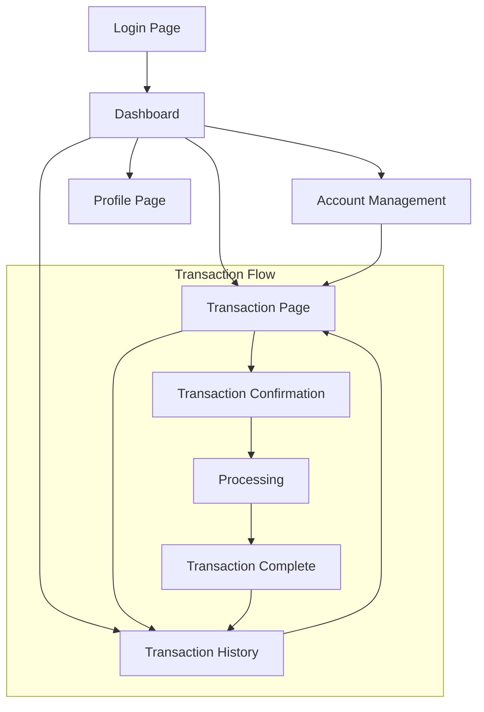

## 1. Product Overview
A modern banking system frontend that provides secure and intuitive account management, financial transactions, and transaction history viewing. The application enables users to manage their bank accounts, perform deposits and withdrawals, transfer funds between accounts, and track their financial activities through a comprehensive transaction history.

The system serves individual banking customers who need convenient access to their financial information and transaction capabilities through a web-based interface.

## 2. Core Features

### 2.1 User Roles
| Role | Registration Method | Core Permissions |
|------|---------------------|------------------|
| Customer | Bank-provided credentials | View accounts, perform transactions, view transaction history |
| Admin | Bank internal registration | Manage user accounts, system configuration, view all transactions |

### 2.2 Feature Module
The banking system frontend consists of the following main pages:
1. **Login/Signup page**: Centered card layout with email/password authentication and social login options.
2. **Dashboard page**: Sidebar navigation with overview cards, charts, and quick actions for account management.
3. **Account management page**: Accounts list with detailed account information and editing capabilities.
4. **Transfers page**: Form-based money transfers with confirmation modal and recent recipients sidebar.
5. **Transaction history page**: Filterable transaction table with export functionality (CSV/PDF).
6. **Profile page**: User information, security settings, password management.

### 2.3 Page Details
| Page Name | Module Name | Feature description |
|-----------|-------------|---------------------|
| Login page | Authentication Form | Centered card with email/password inputs, login/signup toggle, social login buttons. Include forgot password link and terms & conditions acceptance. |
| Dashboard page | Overview Cards | Row 1: Total balance card, pending transfers card, recent transactions card with key metrics and status indicators. |
| Dashboard page | Charts Section | Row 2: Spending breakdown chart (pie/donut), income vs expense chart (line/bar) with time period selectors. |
| Dashboard page | Quick Actions | Row 3: Transfer button, deposit button, pay bills button with prominent styling and hover effects. |
| Account management page | Accounts List | Card-based layout displaying account info: account number, type, current balance, status. Each card clickable for details. |
| Account management page | Account Detail Page | Transaction summary section, complete account information display, editable nickname field with save functionality. |
| Transfers page | Transfer Form | Form with: From account dropdown, To account dropdown, Amount input with validation, Note text field. Submit button triggers confirmation modal. |
| Transfers page | Recent Recipients Sidebar | Right sidebar showing frequently used recipients with quick-select functionality and add new recipient option. |
| Transaction history page | Transaction Table | Table with columns: Date, Description, Amount, Type, Status. Sortable headers with visual indicators. |
| Transaction history page | Filters Section | Date range picker, account filter dropdown, transaction type filter. Apply/clear filter buttons. |
| Transaction history page | Export Functionality | CSV and PDF export buttons with loading states and success/error notifications. |
| Profile page | User Information | Display and edit personal information including name, email, phone number, and address. Accessed via header user profile dropdown. |

## 3. Core Process

### Customer Flow
1. User accesses the login page and enters credentials
2. System authenticates and redirects to dashboard
3. User can view account balances and recent activity
4. User performs transactions (deposit, withdrawal, transfer)
5. User views detailed transaction history
6. User manages profile and security settings

### Transaction Processing Flow
1. User selects transaction type and enters details
2. System validates input and account balance
3. User confirms transaction details
4. System sends request to backend API
5. Transaction processed and confirmation displayed
6. Transaction appears in history with status updates

```mermaid
graph TD
  A[Login Page] --> B[Dashboard]
  B --> C[Account Management]
  B --> D[Transaction Page]
  B --> E[Transaction History]
  B --> F[Profile Page]
  C --> D
  D --> E
  E --> D
  
  subgraph "Transaction Flow"
    D --> G[Transaction Confirmation]
    G --> H[Processing]
    H --> I[Transaction Complete]
    I --> E
  end
```

## 4. User Interface Design

### 4.1 Design Style
- **Primary Colors**: Professional blue (#0066CC) for primary actions, white background
- **Secondary Colors**: Green (#28A745) for positive actions, red (#DC3545) for warnings/errors
- **Button Style**: Rounded corners with subtle shadows, clear hover states
- **Font**: Clean sans-serif (Inter or similar), 16px base size with clear hierarchy
- **Layout Style**: Card-based layout with consistent spacing, top navigation with sidebar
- **Icons**: Professional banking icons using Font Awesome or similar library

### 4.2 Page Design Overview
| Page Name | Module Name | UI Elements |
|-----------|-------------|-------------|
| Login page | Authentication | Centered card (1440px desktop) with clean input fields, social login buttons (Google, Facebook), password visibility toggle, professional banking aesthetic. |
| Dashboard page | Layout Structure | Fixed left sidebar with navigation, header with logo and user profile/notifications, main content area with three-row grid layout for cards, charts, and actions. |
| Account management page | Account Cards | Card-based layout with account information clearly displayed, hover effects, and click-to-view-details functionality. |
| Transfers page | Transfer Form | Clean form layout with dropdown selectors, amount input with currency formatting, note field, prominent submit button leading to confirmation modal. |
| Transaction history page | Data Table | Professional table design with alternating row colors, status badges (green for completed, yellow for pending, red for failed), clear typography and spacing. |
| Profile page | User Information | Form layout with labeled sections, save/cancel buttons, profile picture upload option |

### 4.3 Responsiveness
The application follows a desktop-first design approach with mobile adaptation:
- Desktop: Full sidebar navigation, multi-column layouts, detailed tables
- Tablet: Collapsible sidebar, adjusted grid layouts, touch-friendly buttons
- Mobile: Bottom navigation bar, single-column layouts, swipe gestures for actions
- Touch optimization: Larger tap targets, gesture support, mobile-appropriate form inputs

### 4.4 Security Considerations
- Session timeout after 15 minutes of inactivity
- Automatic logout on suspicious activity detection
- Masked sensitive data display (account numbers, balances in public view)
- Secure password requirements with strength indicators
- Transaction confirmation dialogs for all financial operations