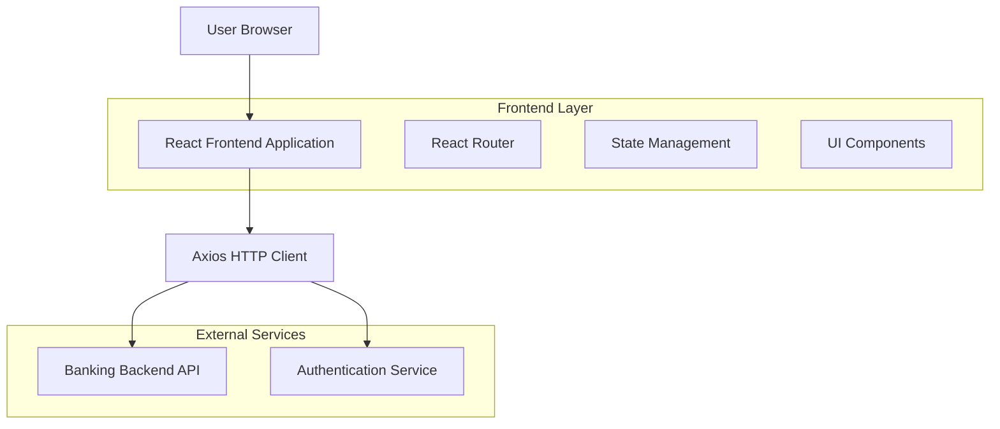
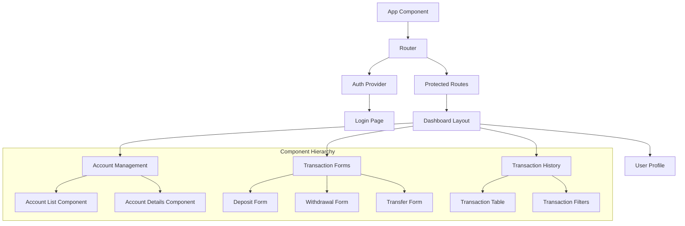

## 1. Architecture design



## 2. Technology Description
- **Frontend**: React@18 + tailwindcss@3 + vite
- **Initialization Tool**: vite-init
- **HTTP Client**: axios@1.6
- **State Management**: React Context API + useReducer
- **Routing**: react-router-dom@6
- **Form Validation**: react-hook-form + yup
- **UI Components**: headlessui + custom components
- **Backend**: External Banking System API (https://github.com/WideSu/banking_system_backend)

## 3. Route definitions
| Route | Purpose |
|-------|---------|
| / | Login page, user authentication entry point |
| /dashboard | Dashboard page, main overview after login |
| /accounts | Account management page, view and manage accounts |
| /transactions | Transaction page, perform deposits/withdrawals/transfers |
| /history | Transaction history page, view all past transactions |
| /profile | Profile page, manage user settings and preferences |
| /logout | Logout endpoint, clear session and redirect to login |

## 4. API definitions

### 4.1 Authentication APIs

**Login**
```
POST /api/auth/login
```

Request:
| Param Name | Param Type | isRequired | Description |
|------------|------------|------------|-------------|
| username | string | true | User's login username |
| password | string | true | User's password |

Response:
| Param Name | Param Type | Description |
|------------|------------|-------------|
| token | string | JWT authentication token |
| user | object | User profile information |
| expiresIn | number | Token expiration time in seconds |

### 4.2 Account Management APIs

**Get User Accounts**
```
GET /api/accounts
```

Headers:
```
Authorization: Bearer {token}
```

Response:
| Param Name | Param Type | Description |
|------------|------------|-------------|
| accounts | array | List of user accounts |
| accounts[].id | string | Account unique identifier |
| accounts[].accountNumber | string | Bank account number |
| accounts[].type | string | Account type (checking/savings) |
| accounts[].balance | number | Current account balance |
| accounts[].status | string | Account status (active/inactive) |

**Get Account Details**
```
GET /api/accounts/{accountId}
```

### 4.3 Transaction APIs

**Create Transaction**
```
POST /api/transactions
```

Request:
| Param Name | Param Type | isRequired | Description |
|------------|------------|------------|-------------|
| type | string | true | Transaction type (deposit/withdrawal/transfer) |
| amount | number | true | Transaction amount |
| sourceAccountId | string | true | Source account ID |
| targetAccountId | string | false | Target account ID (for transfers) |
| description | string | false | Transaction description |

**Get Transaction History**
```
GET /api/transactions?accountId={accountId}&fromDate={fromDate}&toDate={toDate}&type={type}
```

## 5. Frontend Architecture



## 6. State Management Structure

### 6.1 Global State
```typescript
interface AppState {
  auth: {
    user: User | null;
    token: string | null;
    isAuthenticated: boolean;
  };
  accounts: {
    list: Account[];
    selectedAccount: Account | null;
    loading: boolean;
    error: string | null;
  };
  transactions: {
    list: Transaction[];
    filters: TransactionFilters;
    loading: boolean;
    error: string | null;
  };
}
```

### 6.2 Component State
- Form validation states
- UI loading states
- Modal visibility states
- Pagination states

## 7. Security Implementation

### 7.1 Authentication
- JWT token storage in httpOnly cookies
- Automatic token refresh mechanism
- Session timeout handling
- Role-based route protection

### 7.2 Data Protection
- HTTPS enforcement for all API calls
- Input sanitization and validation
- XSS protection through React's built-in escaping
- CSRF token implementation

### 7.3 Error Handling
- Centralized error boundary component
- API error mapping to user-friendly messages
- Logging of security-related errors
- Graceful degradation for failed requests

## 8. Performance Optimization

### 8.1 Code Splitting
- Route-based code splitting using React.lazy
- Component-level splitting for heavy UI elements
- Vendor bundle separation

### 8.2 Caching Strategy
- API response caching for account data
- Client-side pagination for transaction history
- Optimistic UI updates for transactions

### 8.3 Loading States
- Skeleton screens for data loading
- Progressive loading for large datasets
- Debounced search inputs

## 9. Error Handling and Logging

### 9.1 Error Types
- Network errors (API unavailability)
- Authentication errors (token expiration)
- Validation errors (form input)
- Business logic errors (insufficient funds)

### 9.2 Error Display
- Toast notifications for user actions
- Inline validation messages for forms
- Full-page error states for critical failures
- Error boundary fallback UI

### 9.3 Logging
- Client-side error logging to external service
- User action tracking for analytics
- Performance monitoring
- Security event logging